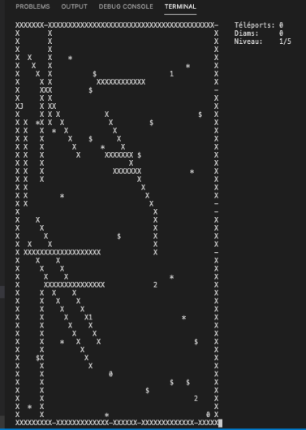
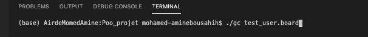
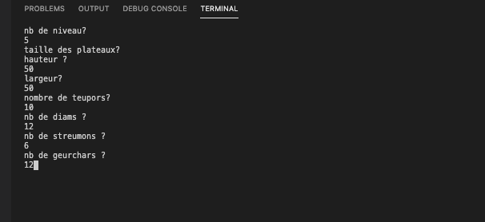
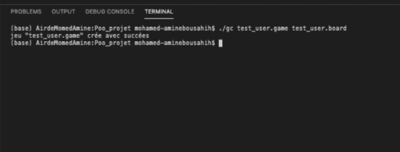
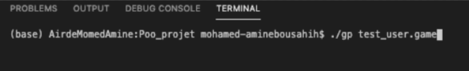
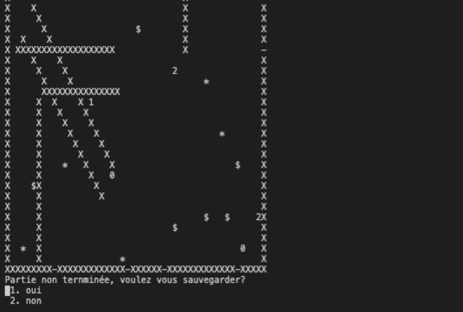
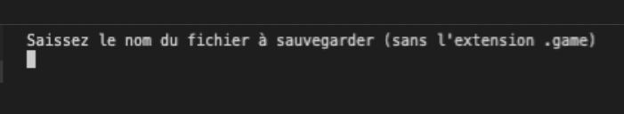

Euj Escape Game - EEG🚪💠🌟🏃👾👾👾
====================================

 Projet C++ 2019/2020 - Langage à Objets Avancé - Université de Paris - Double Master Mathématiques, Informatique parcours Data Science (MIDS). 

 Tuteur : Jean-Baptiste Yunès (aka JBY). 

 Réalisé par : Mohamed Boudokhane et Mohamed-Amine Bousahih.

Description du projet
---------------------

Ce projet a pour but de proposer la création d'un ensemble de deux applications écrites en langage C++ : une application de conception de plateaux de jeu et une application permettant de jouer sur un ensemble de plateaux. 

Le jeu est à temps discret directement piloté par l'utilisateur. Celui-ci déplace à l'aide d'un clavier un personnage afin d'aller récupérer un maximum de trésors tandis que des personnages hostiles automatisés tentent de l'en empêcher. 

Votre mission est la suivante : réussir à traverser tous les plateaux.

Attention : nos amis les streumons 👾 apprennent de leurs erreurs et deviennent de plus en plus intelligents ... 

Concepts de bases
-----------------

 Un oueurj 🏃 symbolisé par le caractère J et qui peut se déplacer, à chaque tour, dans l'une des huits adjacentes (si possible), rester sur place ou se téléporter (voir après).

 Des streumons 👾 symbolisés par le caractère s et qui peuvent se déplacer, à chaque tour, dans l'une des huits cases adjacentes (si possible). Un streumon n'a qu'un but dans la vie : dévorer le oueurj.

 Des reumus symbolisés par X. Un reumu est inamovible et aucun élément ne peut le traverser ou monter dessus. C'est un obstacle parfait. Il y a tout autour du plateau des reumus ainsi qu'au moins une teupors (voir après).

 Des diams 💠 symbolisés par le caractère $ qui peuvent être rammassés par le oueurj. Celui-ci doit d'ailleurs en ramasser au moins un avant qu'une porte de sortie ne s'ouvre et qu'il puisse tenter de s'y engouffrer. Les diams sont ignorés par les streumons.

 Des geurchars 🌟 symbolisés par le caractère * et qui permettent d'obtenir, pour le oueurj, une possibilité de téléportation en plus et activable à volonté.

 Des teupors 🚪 symbolisés par + si elles sont ouvertes et - si fermées. A chaque fois que le oueurj ramasse un diam une nouvelle teupor s'ouvre par laquelle le oueurj peut sortir du plateau.

Représentation d'un plateau
-------------------

Commandes de bases 
--------------------

En tant qu'utilisateur, vous contrôlez le oueurj à travers ses déplacements :

- z : déplacement en haut.
- a : déplacement en haut diagonale gauche.
- e : déplacement en haut diagonale droite.
- d : déplacement à droite.
- q : déplacement à gauche.
- x : déplacement en bas.
- c : déplacement en bas diagonale droite.
- w : déplacement en bas diagonale gauche.
- s : arrêter le jeu.

Lorsque vous récupérez des geuchars 🌟 , vous avez la possibilité de vous téléportez (de manière infini) :

- t : téléportation aléatoire sur une position (i,j) du plateau.

Attention : dans certaines situations, vous remercierez votre ami le geuchar 🌟 de vous avoir sauvé des streumons 👾. Dans certains cas, il peut vous mettre dans des situations délicates ...

Extensions utiles 
-----------------

  Les streumons 👾 

Au cours de votre partie, vous aurez l'occasion de rencontrer différents types de streumons doués de plus ou moins d'intelligence (cf représentation plateau ci-dessus):

- Type n°0 : ce sont des streumons qui ne sont pas allé à l'école des streumons quand ils étaient petit ... leurs déplacements sont aléatoires et ne tiennent pas en compte de la position du oueurj.

- Type n°1 : diplômés de l'école des streumons, ils appliquent l'algorithme A* à la perfection afin de rechercher le chemin le plus court afin de dévorer le oueurj !.

- Type n°2 : ce sont des streumons schizophrène qui passent de l'état "aléatoire" à l'état "A*" à tout moment. 

Lorsque les streumons se marchent dessus, différentes interactions sont possibles :

- L'élimination : si deux streumons se marchent dessus alors ils disparaissent.

- La reproduction : si deux streumons se marchent dessus alors ils disparaissenent et engendrent un baby streum ! (une sorte de reproduction comme les poissons ...).

- La création d'artefact : si deux streumons se marchent dessus alors ils disparaissent et engendrent un trésor (un diams 💠 ou un geuchar 🌟 ). Le oueurj 🏃 s'en réjouira ! 

Lancement du jeu 🎮
-----------------

Le temps est venu de vous expliquez comment configurer et lancer une partie afin que votre aventure EEG puisse débuter !. 

 Configurations  

Avant de pouvoir enfiler vos baskets et courir dans les plateaux pour éviter les streumons, il y a deux choses à réaliser : 

> ./gc [votre nom de fichier].board

Cette commande permet de créer des plateaux (fichiers d'extensions .board). Elle enclenchera directement un menu qui vous demandera de spécifier quelques paramètres afin de configurer vos plateaux :

- le nombre de levels que vous voulez
- la taille de vos plateaux (hauteur, largeur)
- le nombre de teupors
- le nombre de diams
- le nombre de streumons
- le nombre de geuchars

Après avoir configurer les plateaux à votre guise, vous devez créer un "jeu" à partir de votre fichier .board précédent en créant un fichier d'extension .game :

> ./gc [votre nom de jeu].game [nom du fichier précédent].board

 Lancer le jeu  

Félicitations, vous avez réussi à faire la part la plus difficile du travail ! 

Afin de pouvoir commencer à jouer et débuter l'aventure EEG, veuillez tappez la commande suivante :

> ./gp [votre nom de game précédent sans extension .game].game

Have fun ! C'est parti pour l'aventure ! 🚪💠🌟🏃👾👾👾

Sauvegarder une partie
-----------------------

Si vous devez mettre fin à cette belle aventure pour rejoindre des amis ou enfin aller bosser après avoir jouer plusieurs heures sur ces plateaux de jeux, vous pouvez arrêter le jeu en appuyant sur le touche 's'. 

Automatiquement, le menu s'affichera en vous proposant la possibilité de sauvegarder votre partie en cours :

Il vous suffit simplement de choisir l'option n°1 puis d'écrire le nom de votre fichier (sans l'extension .game) et de reprendre votre partie dès que vous avez à nouveau du temps libre (en tappant à nouveau ./gp nomfichier.game ).

PS : ça ne sert à rien d'appuyer sur 's' puis de sauvegarder votre partie avant qu'un streumon ne vous dévore ... il sera patient et vous attendra dès votre retour ... 👾👾👾

