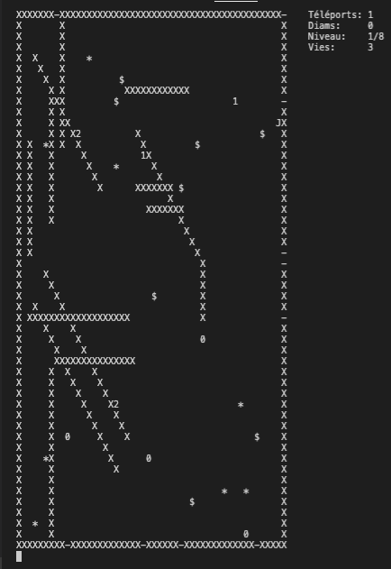
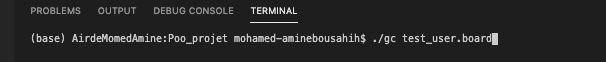
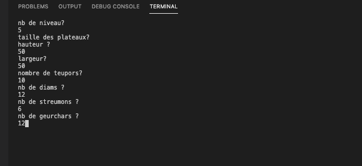
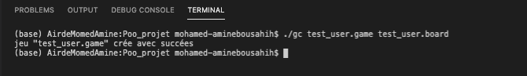
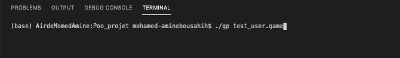
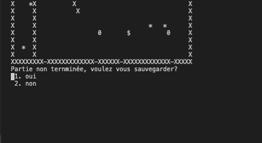
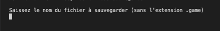

# Euj Escape Game - EEG🚪💠🌟🏃👾👾👾

Projet C++ 2019/2020 - Langage à Objets Avancé - Université de Paris - Double Master Mathématiques, Informatique parcours Data Science (MIDS).

Tuteur : Jean-Baptiste Yunès.

Réalisé par : Mohamed Boudokhane et Mohamed-Amine Bousahih.

## Description du projet

Ce projet propose la création d'un ensemble de deux applications écrites en langage C++ : une application de conception de plateaux de jeu et une application permettant de jouer sur un ensemble de plateaux.

Le jeu est à temps discret, directement piloté par l'utilisateur. Celui-ci déplace à l'aide du clavier un personnage afin d'aller récupérer un maximum de trésors tandis que des personnages hostiles, automatisés, tentent de l'en empêcher.

Votre mission est la suivante : réussir à traverser tous les plateaux.

Attention : les streumons 👾 deviennent de plus en plus intelligents au fil des niveaux.

## Concepts de bases

Un oueurj 🏃 symbolisé par le caractère J et qui peut se déplacer, à chaque tour, dans l'une des huits adjacentes (si possible), rester sur place ou se téléporter.

Des streumons 👾 symbolisés par '0', '1' ou '2' (leur symbole indique le type déplacement) et qui peuvent se déplacer, à chaque tour, dans l'une des huits cases adjacentes (si possible). Un streumon n'a qu'un but dans la vie : dévorer le oueurj.

Des reumus symbolisés par 'X'. Un reumu est un obstacle inamovible et aucun élément ne peut le traverser. Ils délimitent le plateau et peuvent former des barrières à l'intérieur du plateau.

Des diams 💠 symbolisés par '\$' qui peuvent être rammassés par le oueurj. Celui-ci doit d'ailleurs en ramasser au moins un avant qu'une porte de sortie ne s'ouvre et qu'il puisse tenter de s'y engouffrer. Les diams sont ignorés par les streumons.

Des geurchars 🌟 symbolisés par '\*' et qui permettent d'obtenir, pour le oueurj, la possibilité de téléportation infinie dans le niveau actuel.

Des teupors 🚪 symbolisés par '+' si elles sont ouvertes et '-' si fermées. A chaque fois que le oueurj ramasse un diam, une nouvelle teupor s'ouvre à travers laquelle le oueurj peut sortir du plateau.

## Représentation d'un plateau



## Commandes de bases

En tant qu'utilisateur, vous déplacez le oueurj:

- z : haut
- x : bas
- d : droite
- q : gauche
- a : haut diagonale gauche
- e : haut diagonale droite
- c : bas diagonale droite
- w : bas diagonale gauche
- s : arrêter le jeu et éventuellement sauvgarder.

Lorsque vous récupérez des geuchars 🌟 , vous avez la possibilité de vous téléporter, de manière infinie dans le niveau actuel :

- t : téléportation aléatoire sur une position (i,j) du plateau.

Attention : dans certaines situations, vous remercierez votre ami le geuchar 🌟 de vous avoir sauvé des streumons 👾. Dans certains cas, il peut vous mettre dans des situations délicates et vous téléporter juste à coté d'un streumon.

## Extensions utiles

Les streumons 👾

Au cours de votre partie, vous aurez l'occasion de rencontrer différents types de streumons doués de plus ou moins d'intelligence (cf représentation plateau ci-dessus):

- Type n°0 : ce sont des streumons qui ne sont pas allé à l'école des streumons quand ils étaient petit ... leurs déplacements sont aléatoires et ne tiennent pas en compte de la position du oueurj.

- Type n°1 : diplômés de l'école des streumons, ils appliquent l'algorithme A\* à la perfection afin de rechercher le chemin le plus court afin de dévorer le oueurj !.

- Type n°2 : ce sont des streumons qui choisissent aléatoirement entre déplacement "aléatoire" et "A\*", la probabilité de A\* augmente au fil des niveaux.

Lorsque les streumons se croisent, différentes interactions sont possibles :

- L'élimination : si deux streumons se croisent alors ils disparaissent.

- La reproduction : si deux streumons se croisent alors ils fusinnent.

- La création d'artefact : si deux streumons se croisent alors ils disparaissent et engendrent un trésor (un diams 💠 ou un geuchar 🌟 ).

## Lancement du jeu 🎮

Le temps est venu de vous expliquez comment configurer et lancer une partie afin que votre aventure EEG puisse débuter !.

### Configuration

Avant de pouvoir enfiler vos baskets et courir dans les plateaux pour éviter les streumons, il faut compiler le projet avec simplement:

```bash
make
```

ensuite il faut générer les plateaux:

```bash
 ./gc fichier.board
```



Cette commande permet de créer des plateaux (fichiers d'extensions .board). Elle enclenchera directement un menu qui vous demandera de spécifier quelques paramètres afin de configurer vos plateaux :

- le nombre de niveaux
- la taille des plateaux (hauteur, largeur)
- le nombre de teupors
- le nombre de diams
- le nombre de streumons
- le nombre de geuchars



Après avoir configuré les plateaux à votre guise, vous devez créer un "jeu" à partir de votre fichier .board précédent en créant un fichier d'extension .game :

```bash
./gc fichier1.game fichier2.board
```



Lancer le jeu

Félicitations, vous avez réussi à faire la part la plus difficile du travail !

Afin de pouvoir commencer à jouer et débuter l'aventure EEG, veuillez tappez la commande suivante :

```bash
./gp fichier.game
```



Have fun ! C'est parti pour l'aventure ! 🚪💠🌟🏃👾👾👾

## Sauvegarder une partie

Si vous devez mettre fin à cette belle aventure, vous pouvez arrêter le jeu en appuyant sur le touche 's'.

Le menu vous proposera la possibilité de sauvegarder votre partie en cours :



Il vous suffit simplement d'écrire le nom de votre fichier (sans l'extension .game) et vous pouvez reprendre votre partie plus tard (en saisissant à nouveau ./gp nomfichier.game).



PS : ça ne sert à rien d'appuyer sur 's' puis de sauvegarder votre partie avant qu'un streumon ne vous dévore ... il sera patient et vous attendra dès votre retour ... 👾👾👾
